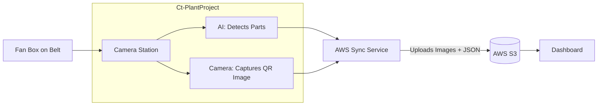

# Fan Inspection System: Multi-Station Integration Proposal

## 1. Executive Summary

As our production requirements expand, we are proposing an upgrade to our current Fan Packaging Inspection System. We currently use a single station (`Ct-PlantProject`) that performs a final check on accessories and captures an image of the QR code. 

To improve traceability and coverage, the client requires a new **Initial Station** placed at the beginning of the belt. This station will actively scan the QR code to extract rich information (rather than just taking a picture of it) and verify the placement of the Fan Motor. This document outlines the proposed architecture to seamlessly integrate this new station with our existing Edge-to-Cloud infrastructure.

---

## 2. Current System Architecture

Currently, the system operates as a single edge node capturing all information at the end of the line and syncing it linearly to the cloud.

### How it Works Now
1. The fan box travels down the conveyor belt.
2. At the inspection station (`Ct-PlantProject`), the camera detects the presence of accessories (Shackle, Downrod, Canopy).
3. A secondary camera takes a static image of the QR label (but does not decode it).
4. The station bundles the inspection image, the QR image, and a pass/fail JSON result.
5. This bundle is pushed to AWS S3, where the Next.js Dashboard (`ct-inspection-logs`) visualizes it.

### Current Workflow Diagram


---

## 3. Proposed Multi-Station Architecture

We will separate the responsibilities into two distinct edge stations. They will operate independently on the factory floor but their data will be unified in the AWS Cloud to present a single, complete history for every scanned box.

### How it Will Work
1. **Station 1 (New - Motor & QR Station)**: Placed at the beginning of the belt. A dedicated QR Scanner instantly extracts the actual data from the code (e.g., batch ID, serial number). The camera detects the Fan Motor. This station uploads a `motor_inspection.json` to a unique folder in AWS S3 based on the QR serial number.
2. **Station 2 (Existing - Accessories Station)**: Placed further down the belt. We will remove the QR camera from this station. It will identify the box passing through (either by tracking its position or a simple secondary scan) and verify the final accessories. It will upload `accessories_inspection.json` to the *same* folder in AWS S3.
3. **AWS S3 Integration**: S3 acts as the unifying brain. Because both stations use the QR code serial number as their ID, the files merge seamlessly.
4. **Cloud Dashboard**: The `ct-inspection-logs` dashboard will be updated to display both the Motor check and the Accessories check side-by-side for a completely traceable lifecycle.

### Proposed Workflow Diagram
```mermaid
flowchart TD
    Box1[Box Enters Line] --> Station1
    
    subgraph station_1 [Station 1: Motor & QR (New)]
    QR[Hardware QR Scanner] --> Ex[Extracts Serial ID]
    Cam1[Motor Camera AI] --> DetectMotor[Detects Fan Motor]
    Ex --> Sync1[Upload motor_inspection.json]
    DetectMotor --> Sync1
    end

    Sync1 -- "S3 Key: /ID/motor.json" --> S3[(AWS S3 Unified Bucket)]

    subgraph station_2 [Station 2: Accessories (Existing)]
    Box2[Box Reaches Exit] --> Cam2
    Cam2[Accessories Camera AI] --> DetectAcc[Detects Parts]
    DetectAcc --> Sync2[Upload accessories_inspection.json]
    end

    Station 1 -.- "Conveyor Belt" -.- Station 2
    Sync2 -- "S3 Key: /ID/accessories.json" --> S3

    S3 --> Dashboard[Inspection Dashboard]
    
    style S3 fill:#f96,stroke:#333,stroke-width:2px
```

---

## 4. Key Implementation Steps

1. **New Edge App Development (Station 1):**
   - Create a lightweight desktop app for the initial station.
   - Integrate hardware QR scanner support (via USB/Serial) to capture exact text strings rather than images.
   - Train and implement a YOLO model specifically for Fan Motor detection.
   - Configure AWS S3 upload logic to use the extracted QR string as the primary `inspection_id`.

2. **Modify Existing App (`Ct-PlantProject`):**
   - Remove the QR image capture logic.
   - Update the S3 synchronization to append its results directly into the folder created/identified by Station 1.

3. **Dashboard Enhancements (`ct-inspection-logs`):**
   - Modify the dashboard to pull *both* JSON files per inspection ID.
   - Design a timeline UI showing a box successfully passing Station 1 and subsequently Station 2.

## 5. Strategic Benefits
- **Zero Database Bottlenecks**: By continuing to use AWS S3 as the integration layer, we avoid costly RDS or DynamoDB setups.
- **Data Accuracy**: Hard-scanning the QR code is more reliable for analytics than taking photos of it.
- **Traceability**: If a box fails, the dashboard will immediately show exactly *which* station it failed at, pinpointing assembly line bottlenecks.
